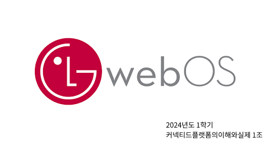
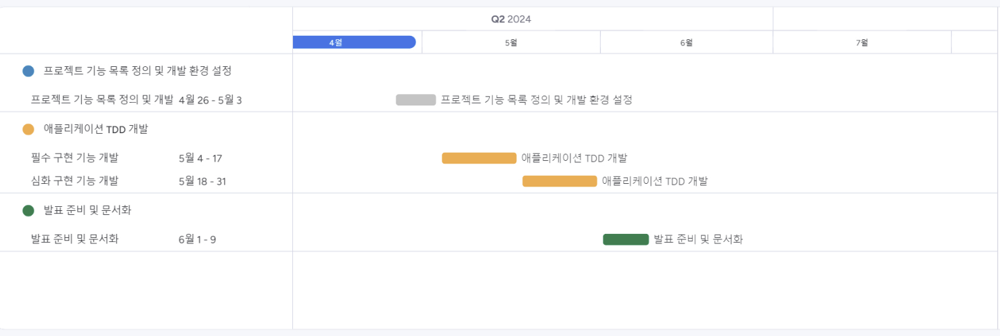

# WebOS-yonsei

### [Discussion](https://github.com/WebOS-yonsei/WebOS-yonsei/discussions)에 개발과 관련된 제안이 있으니 확인해 주세요!

## ✔️ 개발 계획 & 팀원

### 0. 주제

- [Media Web Application로 결정](https://github.com/WebOS-yonsei/WebOS-yonsei/discussions/9)

### 1. 개발 문화 정립

- [깃허브 컨벤션](https://github.com/WebOS-yonsei/WebOS-yonsei/discussions/6) 및 코딩 컨벤션 논의
- 클라이언트 기술 스택: enact Framework
- 서버 기술 스택: Spring Boot Framework, Java, MySQL, JdbcTemplate

### 2. 기능 목록 정의

- 5월 1주차 이내로 기능 목록 작성
- **필수 구현 기능 정의**
  - 실시간 시스템 자원현황 시각화 (CPU, Memory)
  - 미디어 재생 목록 제공
  - 일반 미디어 재생 기능
  - 미디어 이어보기 기능
  - 사용자 식별 기능
- **심화 구현 기능 정의**
  - 등급(연령)별 시청 컨텐츠 차등 적용

### 3. 팀원 역할 분담 (변동 가능)

- 최진호(2019147002): client 개발, 디자인
- 조은기(2019147029): server 개발, DevOps, merge 전 Test Code 검수
- 강슬미(2020147542): server/client 개발
- 김현중(2019147026): server 개발, QA

### 4. 개발 일정

- 프로젝트 기능 목록 정의 및 개발 환경 설정 (1주)
- 애플리케이션 TDD 개발 (4주)
  - 필수 구현 기능 개발 (2주)
  - 심화 구현 기능 개발 (2주)
- 발표 준비 및 문서화 (1주)
