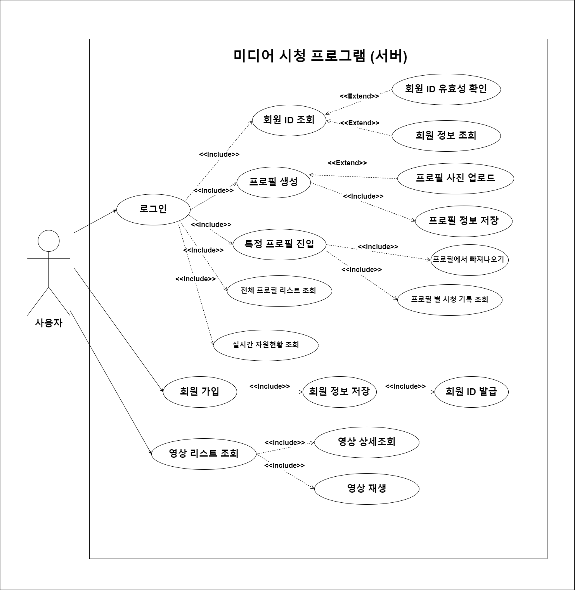
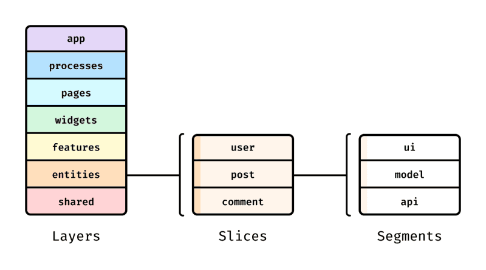
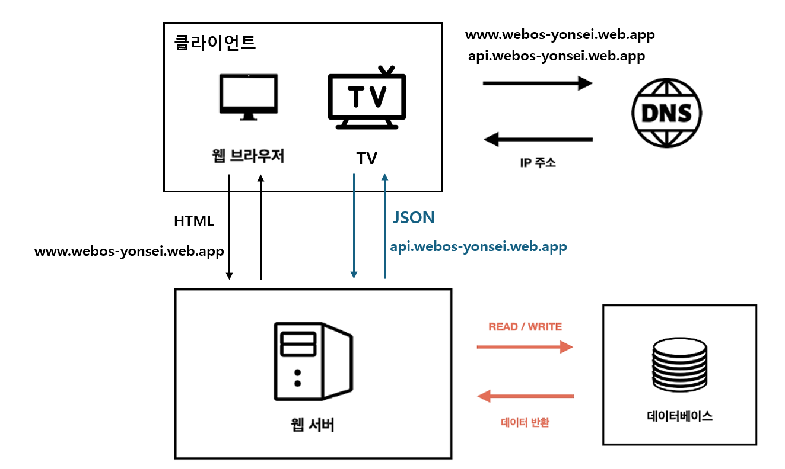
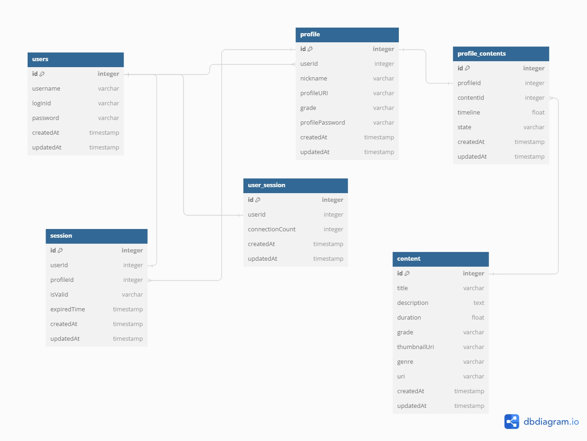

# Media Web Application 시청 프로그램

## 1. Overview

### 1.1 목적 (Purpose)

본 문서의 목적은 다음과 같다:

- 요구 사항 분석: System의 Fuctional 및 Non Functional Requirements를 명확히 정의하여 모든 이해관계자들이 동일한 이해를 갖도록 한다.

- 설계 Guide Line 제공: System Architecture, Database Design, Interface, 주요 Components간의 상호작용에 대한 명확한 지침을 제공하여 팀이 일관되게 작업할 수 있도록 한다.

- Communication 도구: 이해관계자 간의 효과적인 Communication을 지원하여 프로젝트 진행 상황과 방향성에 대한 명확한 이해를 돕는다.

### 1.2 범위 (Scope)

설계 문서의 범위는 다음과 같다:

- System 개요: Media Web Application 시청 프로그램의 목적과 주요 기능에 대한 개요를 제공한다.

- Architecture 개요: System의 전반적인 Architecture, 주요 Component, 이들 간의 상호 작용을 설명한다.

- Data Model: Database 설계, 주요 Entity, 속성, 관계 및 데이터 흐름을 포함한다.

- Interface 설계: 사용자 인터페이스(UI) 및 시스템 간 인터페이스(API) 설계를 포함한다.

### 1.3 개발 환경 (Development Environment)

- OS: Ubuntu 20.04

- FrontEnd: Enact

- BackEnd: Spring

- Database: MySQL

## 2. Architectural Driver

### 2.1 UseCase Diagram

### 2.2. Functional Requirements

#### 2.2.1 로그인 이전 상태

1. `FR01`: 회원 가입

   - `FR01-1`
     - 사용자로부터 아이디 발급 요청을 받으면 사용자 정보를 입력받고, 사용할 수 있는 사용자 ID를 발급한다.
   - `FR01-2`
     - 발급 받은 ID와 해당 사용자 정보를 함께 저장한다.

2. `FR02`: 로그인
   - `FR02-1`
     - 사용자로부터 로그인 요청을 받으면 사용자 ID를 입력받고, 서버의 데이터베이스에 등록되었는지 여부를 확인해 등록되어 있다면 로그인을 수행한다.

#### 2.2.2 로그인 이후

3. `FR03`: 프로필 생성

   - `FR03-1`
     - 사용자로부터 프로필 생성 요청을 받으면 프로필 정보를 입력받고, 사용할 수 있는 프로필 ID를 발급한다.
   - `FR03-2`
     - 원하는 이미지를 업로드 하고 해당 이미지와 프로필 ID 정보를 함께 저장한다.

4. `FR04`: 프로필 리스트 조회

   - `FR04-1`
     - 사용자로부터 프로필 리스트 조회 요청을 받으면 해당 사용자 ID에 존재하는 모든 프로필 정보를 반환한다.

5. `FR05`: 프로필 진입

   - `FR05-1`
     - 사용자로부터 특정 프로필 진입 요청을 받으면 해당 프로필이 데이터베이스에 존재하는지 확인 후 프로필 진입을 수행한다.

6. `FR06`: 프로필에서 빠져나오기

   - `FR06-1`
     - 프로필로부터 빠져나오고자하는 요청을 받으면 프로필 진입 상태로 돌아간다.

7. `FR07`: 영상 리스트 조회

   - `FR07-1`
     - 사용자로부터 영상 리스트 조회 요청을 받으면 존재하는 모든 영상 정보를 반환한다.

8. `FR08`: 영상 재생

   - `FR08-1`
     - 사용자로부터 미디어 재생 요청을 받으면 재생을 원하는 미디어 파일을 입력받고, 재생 가능한 파일인지 확인한다.
   - `FR08-2`
     - 사용자가 선택한 미디어에 대해 이전에 재생한 기록이 있으면 해당 위치부터 재생을 시작한다.
   - `FR08-3`:
     - 미디어 재생 과정에서 재생/일시 정지 기능을 지원한다.

9. `FR09`: 실시간 자원현황 조회

   - `FR09-1`
     - 실시간 자원현황 조회 요청을 받으면 현재 CPU, Memory 사용에 대한 정보를 반환하고 이를 시각화 한다.

10. `FR10`: 로그아웃
    - `FR10-1`: 로그아웃 요청을 받으면 로그인 이전 상태로 돌아간다.

### 2.3 Non-Functional Requirements

#### 2.3.1 성능 (Perfomance)

- 응답 시간: 모든 User Interface 요청은 2초 이내에 응답해야 한다.

- 동시 사용자 수용량: System은 최대 10,000명의 동시 사용자를 지원할 수 있어야 한다.

- 스트리밍 속도: HD 영상 스트리밍은 버퍼링 없이 제공되어야 한다.

#### 2.3.2 확장성 (Scalability)

- 수평 확장성: System은 필요에 따라 서버를 추가하여 수평적으로 확장할 수 있어야 한다.

- 데이터베이스 확장성: 데이터베이스는 증가하는 사용자와 데이터 양에 따라 확장 가능해야 한다.

#### 2.3.3 보안 (Security)

- 데이터 암호화: 모든 데이터 전송은 SSL/TLS를 통해 암호화되어야 한다.

- 사용자 인증: OAuth 2.0 프로토콜을 사용하여 사용자 인증을 처리한다. 사용자가 로그인하면 Access Token이 발급되며, 이 토큰을 통해 사용자는 인증된 세션을 유지 할 수 있다.

- 세션 관리: 발급된 Access Token은 사용자 세션을 유지하는데 사용되며, Token의 유효 기간 동안 사용자는 지속적으로 인증된 상태를 유지한다. Token이 만료되면 자동으로 갱신 요청을 통해 새로운 Token을 발급 받는다.

- 권한 부여: 각 사용자는 할당된 역할에 따라 다른 권한을 가진다. 사용자 요청 시 액세스 토큰에 포함된 권한 정보를 기반으로 접근 제어가 이루어진다.

- 토큰 보안: 모든 토큰은 안전하게 저장 및 전송되어야 하며, 토큰 탈취를 방지하기 위해 HTTPS를 사용한다. 또한, 토큰은 짧은 유효 기간을 가지며, 정기적으로 갱신이 필요하다.

#### 2.3.4 신뢰성 (Reliability)

- 가용성: 시스템 가용성은 99.9% 이상이어야 한다.

- 백업 및 복구: 데이터는 매일 백업되며, 재해 복구 계획이 마련되어 있어야 한다.

- 장애 대응: 시스템 장애 발생 시 1시간 이내에 복구가 가능해야 한다.

## 3. Architectural Overview

### 3.1 Frontend Architecture

해당 프로젝트의 프론트엔드 파트는 FSD(Feature-Sliced Design)을 채택했다.
Feature-Sliced Design은 기능에 따라 layer를 나누어 모듈간의 느슨한 결합과 높은 응집력을 제공하는 프론트엔드 아키텍처이다.
FSD는 layer, slice, segment로 이루어져 있다.

#### layer

- app: 애플리케이션 로직 초기화, 진입점
- processes: 여러 페이지에 걸친 프로세스 처리 (선택적)
- pages: 애플리케이션의 페이지 포함
- widgets: 독립적인 UI 컴포넌트
- features: 사용자 시나리오와 기능 (선택적)
- entities: 비즈니스 엔티티 (선택적)
- shared: 재사용 가능한 컴포넌트와 유틸리티
  레이어는 코드베이스를 조직화하고 유지보수가 용이한 아키텍처를 촉진한다. 계층 구조에서 낮은 레이어일수록 변경의 파급효과가 크다.

#### slice

각 레이어는 비즈니스 영역에 따라 슬라이스로 나뉜다. 예를 들어 소셜 네트워크에서는 게시물, 사용자, 뉴스피드 등이 슬라이스가 될 수 있다.

#### segment

각 슬라이스는 api, UI, model, lib, config, consts 등의 세그먼트로 구성된다. 각 세그먼트는 특정 기능을 담당하며, 공개 API를 통해 외부 접근을 제어한다.

해당 프로젝트는 FSD를 채택하여 다음과 같은 구조를 택했다.

- app: 애플리케이션 로직 초기화, 진입점
- pages: 애플리케이션의 페이지 포함(routes로 구현)
- features: 사용자 시나리오와 기능
- widgets: 독립적인 UI 컴포넌트
- shared: 재사용 가능한 컴포넌트 및 유틸리티(개념적으로 정의)
  - hooks: 재사용 가능한 react hook들
  - styles: 재사용 가능한 style들
  - typings: 재사용 가능한 type들
  - utils: 재사용 가능한 utility들

### 3.2 Backend Architecture

#### 웹 서버:

##### 역할 및 기능:

- 웹 서버는 클라이언트로부터 요청을 받아 이를 처리하여 클라이언트에 응답한다. 클라이언트는 웹 브라우저 또는 TV일 수 있으며, 각각 HTML 또는 JSON 데이터를 요청할 수 있다.
- 웹 서버는 클라이언트로부터 HTML 요청을 받으면, 해당 요청을 처리하여 적절한 HTML 페이지를 생성하여 클라이언트에 반환한다. 이를 통해 사용자는 웹 페이지를 브라우저에서 볼 수 있다.
- 웹 서버는 또한 클라이언트로부터 JSON 요청을 받으면, 해당 요청을 처리하여 적절한 JSON 데이터를 생성하여 클라이언트에 반환한다. 이 과정은 주로 API 호출을 통해 이루어지며, TV와 같은 장치에서 데이터를 받아 처리하는 데 사용된다.

##### MVC 아키텍처:

- **Model (모델)**: 데이터와 관련된 논리적 부분을 담당한다. 데이터베이스와의 상호작용을 통해 데이터를 조회, 삽입, 수정, 삭제하는 기능을 제공한다. 모델은 비즈니스 로직을 포함하여 데이터의 상태와 동작을 정의한다.
- **View (뷰)**: 사용자 인터페이스 요소를 담당한다. 모델에서 제공된 데이터를 기반으로 HTML 또는 JSON 응답을 생성한다. 브라우저에서는 HTML 뷰를 사용하고, TV와 같은 장치에서는 JSON 뷰를 사용한다.
- **Controller (컨트롤러)**: 사용자 입력을 처리하고, 모델을 조작하며, 적절한 뷰를 선택하여 클라이언트에 응답한다. 클라이언트의 요청을 받아 어떤 작업을 수행할지 결정하고, 필요한 데이터를 모델에서 가져와 뷰에 전달한다.

##### 데이터베이스와의 통신:

- 웹 서버는 데이터베이스와 통신하여 데이터를 읽고 쓰는 역할을 한다. 이를 통해 클라이언트가 요청한 데이터나 입력한 데이터를 저장하고 관리할 수 있다.
- 데이터베이스와의 통신은 주로 SQL 쿼리를 통해 이루어지며, 이를 통해 웹 서버는 데이터베이스에서 필요한 데이터를 조회하거나 업데이트할 수 있다.

#### 데이터베이스:

##### 역할 및 기능:

- 데이터베이스는 웹 서버로부터 READ/WRITE 요청을 받아 데이터를 반환한다. 클라이언트가 요청한 데이터를 저장하고 관리하며, 필요에 따라 데이터를 수정하거나 삭제할 수 있다.
- 데이터베이스는 데이터의 무결성과 일관성을 유지하면서 대량의 데이터를 효율적으로 관리하는 역할을 한다.

##### 웹 서버와의 상호작용:

- 웹 서버는 클라이언트의 요청을 처리하기 위해 데이터베이스에 쿼리를 전송한다. 예를 들어, 클라이언트가 특정 사용자 정보를 요청하면, 웹 서버는 데이터베이스에 해당 사용자 정보를 조회하는 쿼리를 보낸다.
- 데이터베이스는 웹 서버로부터 받은 쿼리를 처리하여 결과를 반환한다. 웹 서버는 이 결과를 받아 클라이언트에 적절한 형식으로 응답한다.
- 웹 서버는 또한 데이터를 삽입, 업데이트, 삭제하는 쿼리를 데이터베이스에 전송할 수 있으며, 데이터베이스는 이를 처리하여 변경된 데이터를 반환한다.

## 4. Data Design

### 4.1 Database Schema

### 4.2 Data Model

데이터 모델은 Application의 Data와 그 Data 간의 Relation을 시각화하고 설명한다.

#### 4.2.1 Users Table

- 사용자 정보를 저장한다.
- 주요 필드: id, username, loginId, password, createdAt, updatedAt

#### 4.2.2 Profile Table

- 사용자의 프로필 정보를 저장한다.
- 주요 필드: id, userId (users 테이블 참조), nickname, profileURI, grade, profilePassword, createdAt, updatedAt

#### 4.2.3 Profile_Contents Table

- 프로필과 콘텐츠 간의 관계를 저장한다.
- 주요 필드: id, profileId (profile 테이블 참조), contentId (content 테이블 참조), timeline, state, createdAt, updatedAt

#### 4.2.4 Content Table

- 콘텐츠 정보를 저장한다.
- 주요 필드: id, title, description, duration, grade, thumbnailUri, genre, uri, createdAt, updatedAt

#### 4.2.5 Session Table

- 사용자의 세션 정보를 저장한다.
- 주요 필드: id, userId (users 테이블 참조, 기본값 null), profileId (profile 테이블 참조), isValid, expiredTime, createdAt, updatedAt

#### 4.2.6 User_Session Table

- 사용자와 세션 간의 연결을 저장한다.
- 주요 필드: id, userId (users 테이블 참조), connectionCount, createdAt, updatedAt

#### 관계 (Relationships)

- users 테이블은 profile 테이블과 1대 다 관계를 가진다.
- profile 테이블은 profile_contents 테이블과 1대 다 관계를 가진다.
- content 테이블은 profile_contents 테이블과 1대 다 관계를 가진다.
- users 테이블은 session 테이블과 1대 다 관계를 가진다.
- profile 테이블은 session 테이블과 1대 다 관계를 가진다.
- users 테이블은 user_session 테이블과 1대 다 관계를 가진다.
